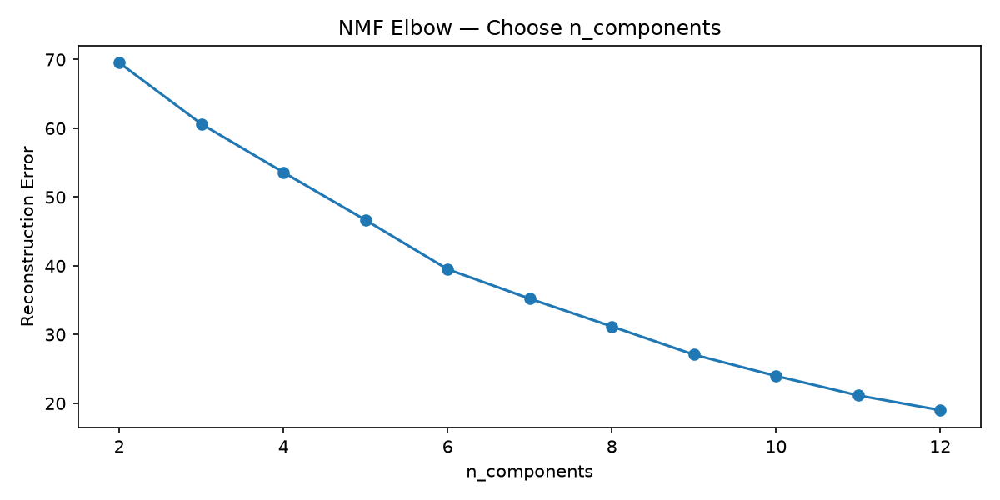
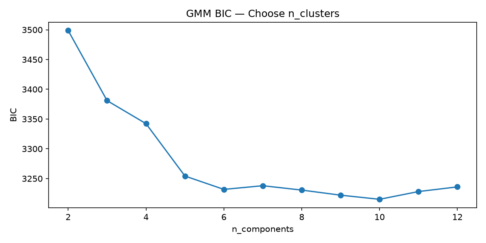
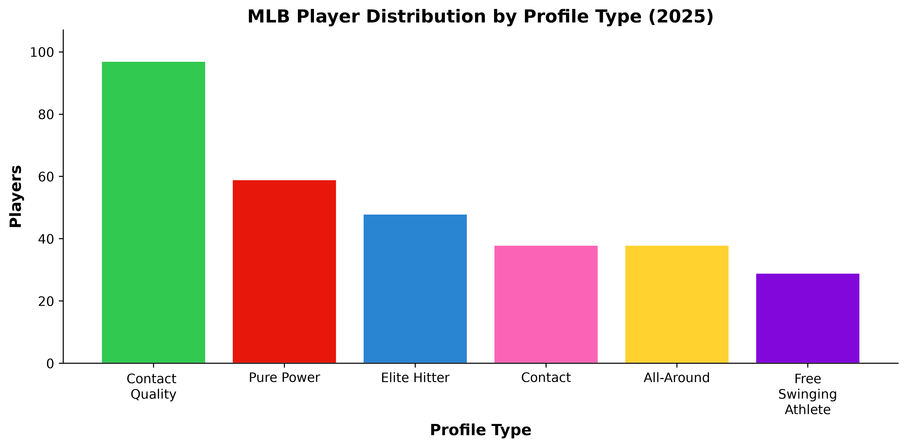
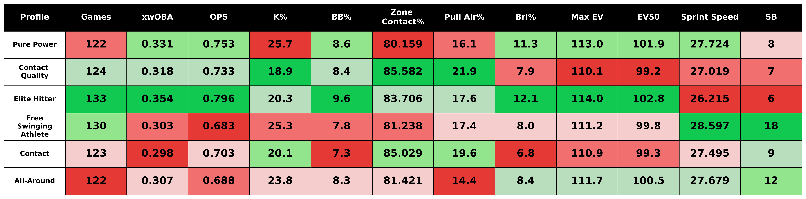
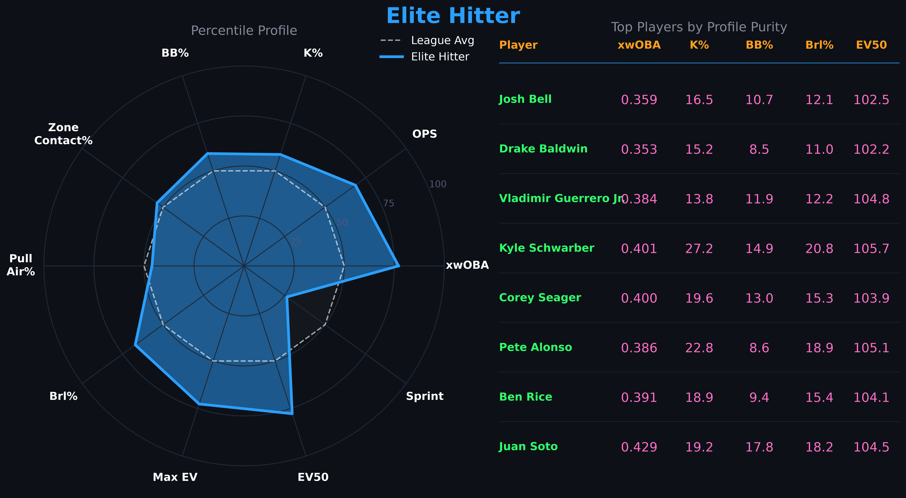
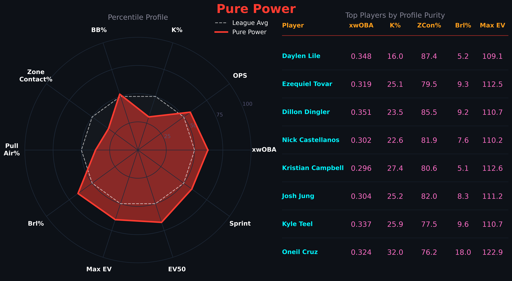
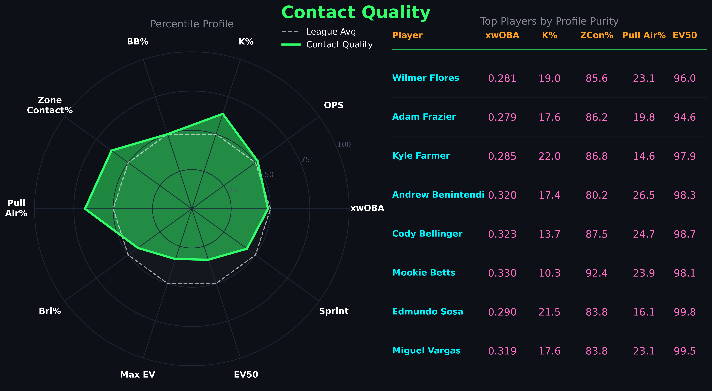
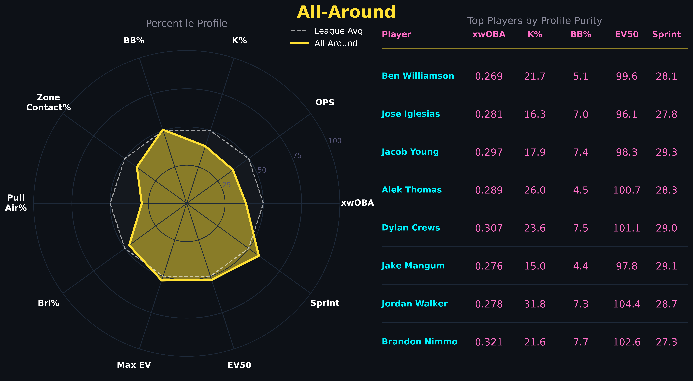
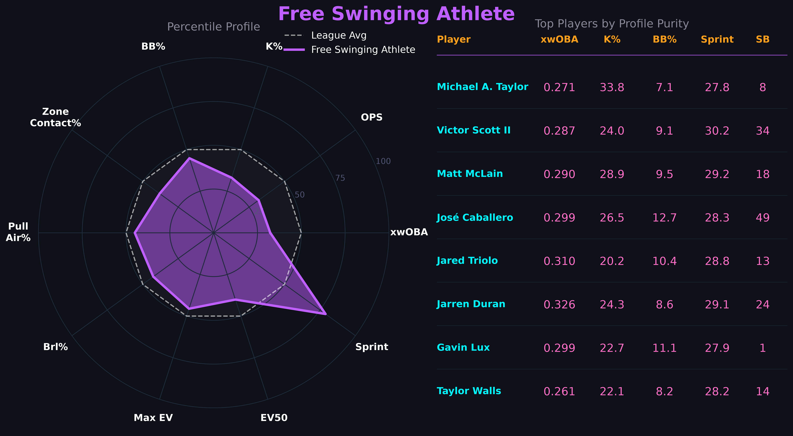
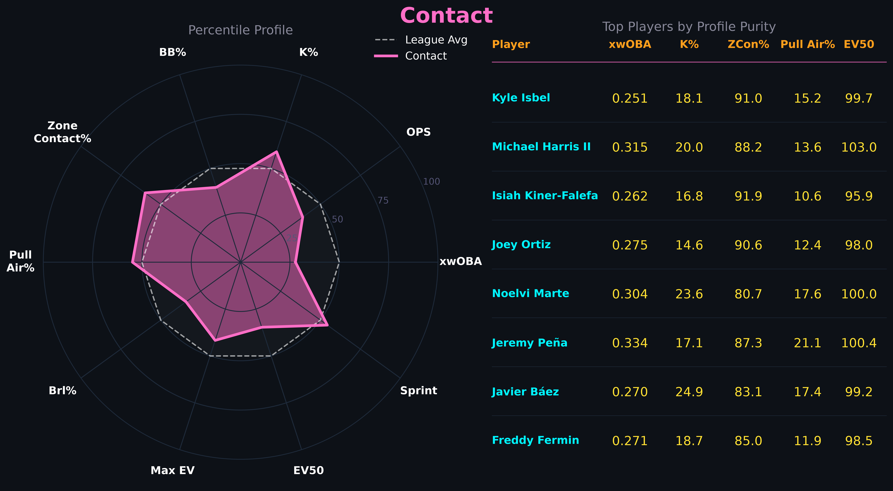

[View on GitHub](https://github.com/hayes-waddell2/mlb-player-profiling)

# Introduction

Every MLB team wants a lineup full of elite hitters. Players who hit for power, get on base, make consistent contact, and run well are the foundation of any successful offense. The problem is those players are rare, expensive, and never all available at the same time. For most teams, building a competitive lineup means assembling a group of complementary player types that collectively produce. That raises a more practical question — what kind of hitter is this player, and what is that worth to a team? Traditional labels like power hitter or contact guy have always existed, but they are largely subjective and fail to capture the nuance of how modern hitters actually perform. With Statcast tracking we have the data to answer that question more precisely. This project uses Statcast data from the 2021–2025 seasons to build a data-driven offensive player profiling system. Rather than assigning labels by hand, the goal is to let the data define how many distinct hitter types exist and what actually separates them — with the longer term aim of combining those profiles with defensive value, positional context, and age to produce a complete picture of what each type of player is worth to a roster.


# Data

All data was sourced from Baseball Savant, MLB's public Statcast platform. Four datasets were pulled covering the 2021-2025 seasons: batting leaderboard, exit velocity leaderboard, sprint speed leaderboard, and baserunning value leaderboard. 2021 was chosen as the starting point because it is the first full season under the Hawk-Eye optical tracking system. This starting point improves the quality and consistency of the training data. Data from the 2021-2024 seasons were used to train the models, with 2025 held out as a test seasons to evaluate how well the profiles generalize to an unseen year. 

## Cleaning

Raw data required several steps before it was ready for modeling. Several metrics were derived from existing columns including barrel rate per plate appearance, home run rate per fly ball, and stolen base percentage. A small number of redundant or uninformative columns were dropped, mostly consisting of counting stats already captured by rate metrics. After joining all four datasets on player ID and season, a minimum plate appearance filter was applied at 250 to ensure adequate sample sizes. The cleaned data consists of 606 unique-players spanning 1589 rows and 53 columns. 

## Feature Engineering

Before modeling, training data spanning four seasons needed to be collapsed into a single row per player. Simply averaging across seasons would treat a player's 2021 and 2024 performances equally, which misrepresents how we should think about a hitter. A player's most recent seasons are more indicative of who they currently are. Additionally, seasons with more plate appearances represent more reliable signals of a player's offensive ability. To address this, a combined PA and recency weighting scheme was applied. Each season's contribution to a player's aggregate is weighted by the number of plate appearances and a recency multiplier. Each player's most recent season carries full weight and each prior season is weighted at 75% of the season before it (ex: 2024 = 1.0, 2023 = 0.75, 2022 = 0.56, 2021 = 0.42). A strong performance over a full season in 2024 carries much greater weight than a strong performance in 2021 over a small sample. This approach ensures the aggregated player profiles reflect both sample reliability and recency.

After aggregation a small number of players were missing exit velocity data on balls in the air due to not meeting Baseball Savants minimum batted ball threshold. These values were imputed using a linear regression on average exit velocity and the 90th percentile exit velocity, which explained 86% of the variance for average exit velocity on balls in the air. Finally, 26 features were selected for modeling covering raw power, bat-to-ball skills, plate discipline, hit shape, and speed. These metrics were standardized using z-scores and shifted to non-negative values for use by the NMF algorithm. The NMF training matrix consists of 384 players across 23 standardized features.

| Skill | Metrics |
|-------|---------|
| Raw Power | brl/bbe, brl/pa, ev_air, ev_max, ev_50th, iso, hr/fb |
| Bat-to-Ball | k%, whiff%, z_contact%, o_contact% |
| Plate Discipline | bb%, chase%, xwoba |
| Hit Shape | launch_angle, gb%, fb%, ld%, pull%, oppo%, sweet_spot% |
| Speed | sprint_speed, sb%, baserunning_runs |

: NMF Features


# Modeling

With the training and test feature matrices prepared, three models were applied in sequence to identify offensive player profiles.

## Non-Negative Matrix Factorization (NMF)

NMF was applied first to decompose the player-feature matrix into a smaller set of latent components. Rather than clustering directly with 26 correlated statistics, NMF learns a compact set of underlying patterns that explain the structure in the data. Ech player is then represented by how strongly the express each component. To select the optimal number of components, NMF was fit across a range of two to twelve and reconstruction error was plotted. The slope of the error curve is relatively consistent, but there does appear to be a noticable elbow point at six components, suggesting six latent offensive dimensions in the data.

{fig-align="center"}

## Dimensionality Reduction with UMAP

The six-component player matrix was then passed through UMAP, which compressed it further into three dimensions. While six components is already a significant reduction from the original 26 features, clustering algorithms can struggle in higher-dimension spaces. UMAP preserves the local structure of the data, keeping similar players close together, while making the clustering step more reliable. 

## Gaussian Mixture Model (GMM)

Finally, a Gaussian Mixture Model was fit on the UMAP output to assign players to clusters. GMM was chosen over simpler approaches like K-Means because it produces soft assignments, rather than forcing each player into exactly one group. GMM assigns a probability of belonging to each cluster. This is more realistic for the context of this project as many baseball players blend multiple types of profiles. The number of clusters was selected by fitting GMM across a range of two to twelve and choosing the value that minimized the Bayesian Information Criterion, a statistical measure that balances model fit against complexity. BIC flattened after six clusters, consistent with NMF results.

{fig-align="center"}

## Validation

To evaluate how well the profiles generalize, the trained models were applied to the held-out 2025 season without any refitting. The average profile purity, a measure of how cleanly each player fits their assigned cluster, was 0.960 on the training set and 0.938 on the test set. The small drop is expected and indicates that the model is not over-fitting. Cluster sizes and proportions were also consistent between the two sets. Suggesting the six profiles reflect stable patterns in how MLB hitters perform rather than artifacts of the training data.


# Results

```{=html}
<iframe src="player_clusters_3d.html" width="100%" height="800px" frameborder="0"></iframe>
```

<p style="text-align: center; font-style: italic; color: grey; font-size: 0.9em;">
MLB Hitter Clusters — 2025 Season (UMAP 3D, hover for player names)
</p>

The model identified six distinct offensive profiles among MLB hitters in the 2025 season. The distribution of players across profiles was reasonably balanced, with no single archetype dominating the league. The largest group was Contact Quality at 97 players, reflecting how many MLB hitters are built around making consistent high quality contact rather than raw power. The smallest was Free Swinging Athlete at 29 players, a more specialized group defined by athleticism rather than offensive production. 

{fig-align="ceneter"}

The table below shows the average statistics for each profile across key metrics used in this analysis. Elite Hitters lead in nearly every offensive category, while Free Swinging Athletes rank last in most metrics but first in sprint speed. Contact Quality and Contact hitters show similar profiles on the surface, but Contact Quality hitters are better at pulling the ball in the air with higher exit velocities and zone contact rates.

{fig-align="center"}


## Profiles

### Elite Hitters

Every lineup is built around this player. Elite Hitters are a rare offensive profile in baseball — just 48 qualified hitters in 2025, not even enough for two per team. What separates this group is not one standout tool but the combination of all of them. They lead the dataset in xwOBA, barrel rate, and exit velocity while posting the best walk rate and lowest chase rate (27.0%) of any profile. They hit for power and get on base — the two things that matter most offensively. The one exception is Elite Hitters rank last in sprint speed. Given how much damage this group produces, they are best suited batting first or second in the order — positions that maximize plate appearances and put their on-base ability to work in front of the heart of the lineup.



### Pure Power

This is your stereotypical power hitter — a player with elite raw power who chases home runs at the cost of elevated strikeout rates. Being the second largest profile in the dataset is indicative of where modern baseball stands. Teams have increasingly built around power production, accepting strikeouts as the tradeoff for extra base damage. The second highest xwOBA in the dataset highlights how valuable that damage is. What is perhaps most interesting about this group is the sprint speed. The slow, lumbering power hitter is increasingly a thing of the past. Modern power hitters are large, extremely athletic players, Oneil Cruz is a perfect example, who combine elite raw power with above average athleticism. Pure Power hitters are best suited for the three spot, where they can drive in runs regardless of base state, or the traditional cleanup role where their ability to clear the bases makes a signifigant impact.




### Contact Quality

The largest profile in the dataset, Contact Quality hitters represent a distinct offensive archetype — players who manufacture production without elite raw power. This group ranks last in exit velocity, yet still posts the third highest xwOBA of any profile. Contact Quality hitters lead the dataset in pull air rate, zone contact rate, and have the lowest strikeout rate. Rather than selling out for power, they make consistent, well-placed contact — pulling the ball in the air at an elite rate to generate extra base hits despite below average raw power metrics. An above average walk rate adds further on-base value on top of their contact skills.
Mookie Betts and Cody Bellinger are textbook examples of this profile — players who produce through elite bat-to-ball skills and plate discipline rather than brute force. This is the type of player who can hit anywhere in the top of a lineup and fill holes for a team deficent in elite hitters and pure power hitters.




### All-Around

The All-Around profile is exactly what the name suggests — a group of hitters with no glaring weaknesses and no standout tools. This group sits near league average across nearly every metric, posting modest power numbers, acceptable contact rates, and average plate discipline. What is notable about this group is how well-rounded the profile is despite ranking near the bottom in xwOBA. The low launch angle and low pull air rate stands out as the primary limiters — these hitters are keeping the ball on the ground more than any other profile, suppressing the power their contact rates and exit velocity might otherwise suggest. Small improvements in approach could meaningfully elevate this group's offensive output.




### Free Swinging Athlete

The Free Swinging Athlete is the most unique profile in the dataset and the hardest to evaluate on offense alone. This group ranks near the bottom in nearly every hitting metric, with a high strikeout rate and below average contact quality. On paper, they are the least productive hitters in baseball. But the sprint speed tells a different story. This group leads the dataset by a significant margin in speed and stolen bases, suggesting their value extends well beyond what the batting line captures. These are elite athletes whose contributions through defense and baserunning are not reflected in offensive statistics alone. It is likely that once defensive metrics are incorporated, this profile looks considerably more valuable. In a lineup they are best utilized at the bottom of the order due to their limited offensive production while having the ability to manufacture runs with their speed when they do reach base. 




### Contact

The Contact profile is the most difficult to build around offensively. On the surface this group resembles Contact Quality — low strikeout rates high zone contact, and high pull air rate — but the underlying production tells a different story. This group ranks last in xwOBA and barrel rate, meaning they are putting the ball in play without doing meaningful damage. The high chase rate and low walk rate further separate them from Contact Quality hitters. While both groups make contact and avoid strikeouts at a similar rate, the Contact group appears to be making weaker contact on pitches out of the zone — limiting both their damage and their ability to get on base. Plate discipline may be the single biggest separating factor driving the significant gap in production between these two otherwise similar profiles. Like the Free Swinging Athlete, this is a group whose overall value may look quite different once defensive context is incorporated.





# Limitations

This analysis has several important limitations to keep in mind. Most notably, the profiles presented here are purely offensive. Defensive ability, positional context, and age are not incorporated into the clustering. This appears particularly relevant for the Free Swinging Athletes, All-Around, and Contact profiles where additional context may significantly change how these players are valued. Platoon splits are also not captured here, which has the potential to make some aggregate profiles misleading as a true representation of offensive ability and value. The minimum plate appearances threshold of 250 per season and 500 overall means that part-time players, prospects, and injury-shortened seasons are excluded. The training window of 2021-2024 is limited but reflects the current state of baseball and increases Statcast metric quality, but it may not generalize to different run environments or rule changes. 


# Future Work

There are several natural extensions to this project. The most immediate next step is incorporating defensive value alongside positional context, age, and service time to build a total player value score. This will give a more complete picture of how valuable each offensive profile actually is and how valuable each player is relative to their profile. The longer term goal of this project is to build a roster construction engine, a tool that can identify profile gaps and optimize the balance of a roster. This project serves as the foundation for the next steps.


