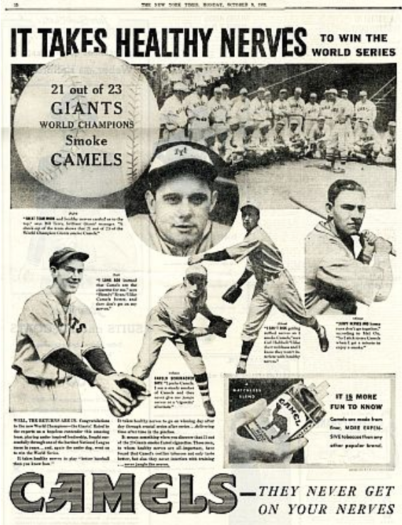

[Read the Paper](nicotine-baseball.pdf)

Nicotine has been intertwined with baseball since the sport's earliest days — players smoked in dugouts, tobacco companies sponsored every team, and cigarette packs included baseball cards that kids collected alongside their favorite players. This paper examines that cultural history alongside the neuroscience of why nicotine use has persisted in the sport long after its health risks became widely known. The central argument is that nicotine's appeal to baseball players is not purely cultural inertia but is grounded in documented cognitive enhancements that directly map onto the demands of the game.

{width="80%," fig-align="center"}

Baseball places extraordinary cognitive demands on players — hitting requires anticipating pitch type and location before the ball is released, processing visual information in milliseconds, and executing precise motor movements where millimeters determine outcomes. Nicotine addresses these demands through its interaction with nicotinic acetylcholine receptors (nAChRs), triggering the release of neurotransmitters including dopamine, acetylcholine, and norepinephrine across brain regions involved in attention, memory, reaction time, and fine motor control. Research demonstrates enhancements in sustained focus, working memory, object recognition, spatial memory, and reaction speed — each directly relevant to performance at the plate. One study found that nicotine measurably improved baseball hitting performance on a task requiring precise bat control.

Nicotine use in baseball offers a window into a broader argument about how society understands substance use. The paper contends that nicotine — like many substances — is stigmatized in ways that ignore the legitimate cognitive needs it fulfills. Players have continued using smokeless tobacco at high rates even after high-profile deaths from oral cancer and MLB restrictions, suggesting the perceived cognitive benefits outweigh the known risks for many. Rather than treating this as a failure of willpower or awareness, the paper frames it as rational self-medication in a high-pressure, cognitively demanding profession — and calls for a more nuanced public conversation about substance use that centers individual need alongside health risk.
