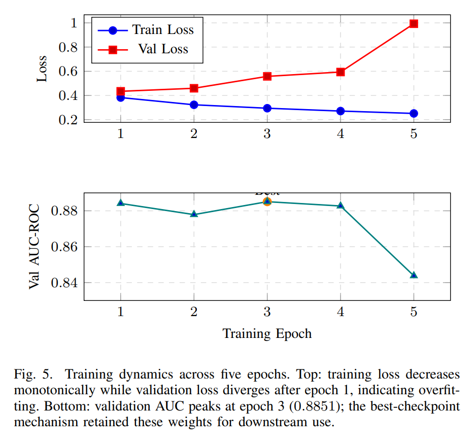
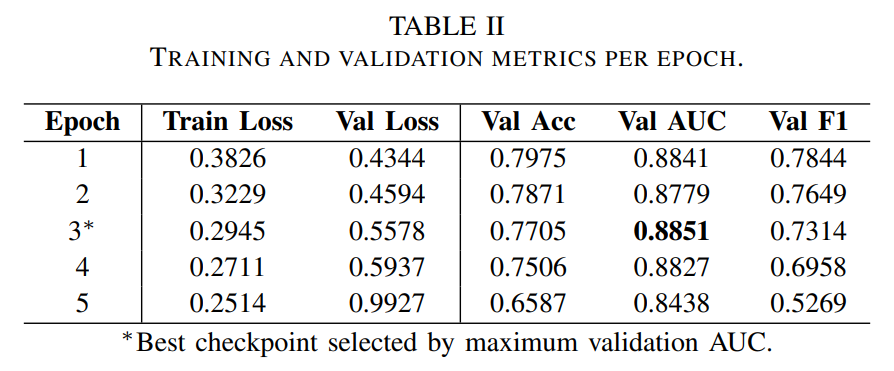
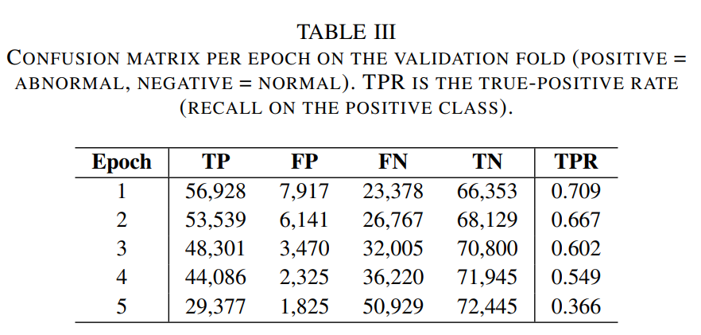

[View on GitHub](https://github.com/hayes-waddell2/DeepLearning-EEG-Pipeline)

[Read the Paper](full_paper.pdf)

Manual review of EEG recordings is time-consuming, subjective, and requires significant clinical expertise - creating bottlenecks in neurological workflows. Deep learning offers a path towards faster, more consistent, and accessible automated classification. Existing work is limited by poor cross-subject generalization, lack of reproducibility, and models that function as black boxes with little to no clinically meaningful interpret-ability. This project builds an end-to-end pipeline that addresses all three gaps simultaneously.

{width=80%, fig-align="center"}

The pipeline is applied to the Temple University Hospital Abnormal EEG Corpus (TUAB v3.0.1), a large-scale clinical dataset of 2,993 recordings totaling over 1,141 hours of EEG data. Recording-level labels (normal or abnormal) were derived from neurologist-authored medical reports via NLP and verified manually. Raw recordings are preprocessed into 30-second segments across 19 standardizes electrode channels, yielding 743,578 training segments at 250 Hz.

{width=80%, fig-align="center"}

The baseline model is a hybrid CNN+LSTM architecture. A three-block CNN extracts spatial-spectral features across channels, which are then passed to a two-layer bidirectional LSTM that models sequential temporal dependencies. The pipeline is designed to be fully modular and ran with a single script calling every module from data loading to predictions. Preprocessing, training, and evaluation are all driven by version-controlled configuration and run reproducibly on a single GPU. Strict subject-disjoint splits are enforced throughout to prevent data leakage. 

:::: {layout-ncol=2}
::: {}

:::

::: {}

:::
::::

The baseline CNN+LSTM achieved a peak validation AUC of 0.89 on a held-out set of subjects unseen during training, confirming the model learns generalizable representations rather than subject-specific artifacts. Planned extensions include a CNN+Transformer comparison model, full leave-one-subject-out cross-validation, and an integrated attention module that will produce temporal and spatial interpretability outputs directly alongside predictions.