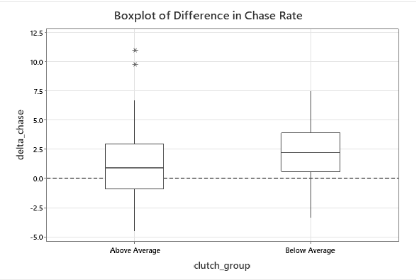

[Read the Paper](leverage_behavior.pdf)

Not all plate appearances matter equally. Leverage Index (LI) quantifies how much a single plate appearance can shift a team's win probability, with high leverage situations — typically late innings in close games — representing moments where outcomes carry the most weight. The prevailing view in baseball analytics holds that clutch performance is largely random rather than a repeatable skill. This study takes a statistical look at that assumption, asking whether performance differences in high leverage situations are systematic across MLB hitters, and whether measurable changes in plate discipline behavior can help explain them. Data spanning the 2023–2025 seasons was sourced from TruMedia Networks, restricted to 143 qualified hitters with sufficient plate appearances across both leverage conditions.

{width=80%, fig-align="center"}

Four analyses build on each other to address the central question. A paired t-test established that the league-wide decline in offensive performance under high leverage is statistically significant — hitters produce a mean xOPS of 0.725 in high leverage situations compared to 0.758 in low leverage, a moderate and consistent directional shift (Cohen's d = −0.52). A repeated measures ANOVA then confirmed that hitters do change their approach under pressure: zone swing rate, chase rate, and whiff rate all increase significantly in high leverage situations, meaning hitters collectively become more aggressive and make less contact when it matters most.

{width=80%, fig-align="center"}

A multiple linear regression tested whether those behavioral changes predict individual performance differential, finding a statistically significant but limited relationship (R² = 6.81%), with whiff rate emerging as the only individually significant predictor. Finally, a two-sample t-test compared behavioral profiles between hitters who outperformed and underperformed the league median change in xOPS, finding that outperformers exhibited significantly smaller increases in both chase rate and whiff rate — but no meaningful difference in zone swing rate.

{width=80%, fig-align="center"}

The results point toward a coherent but partial picture. The behavioral signature of relative success under pressure appears to be stability rather than improvement — outperformers are essentially the same hitters in high leverage that they are in low leverage, resisting the pull toward expanded zone coverage and more swing-and-miss. However, the small effect sizes and low explained variance across all four analyses make clear that plate discipline changes alone are far from a complete explanation of clutch performance. Pitcher quality, count and base-out state, pitch usage, and individual baseline skill differences all represent meaningful sources of variation that this study does not capture. These findings are best understood as identifying a measurable behavioral signal within a much larger and more complex phenomenon — not as resolving the question of whether clutch performance is real.

